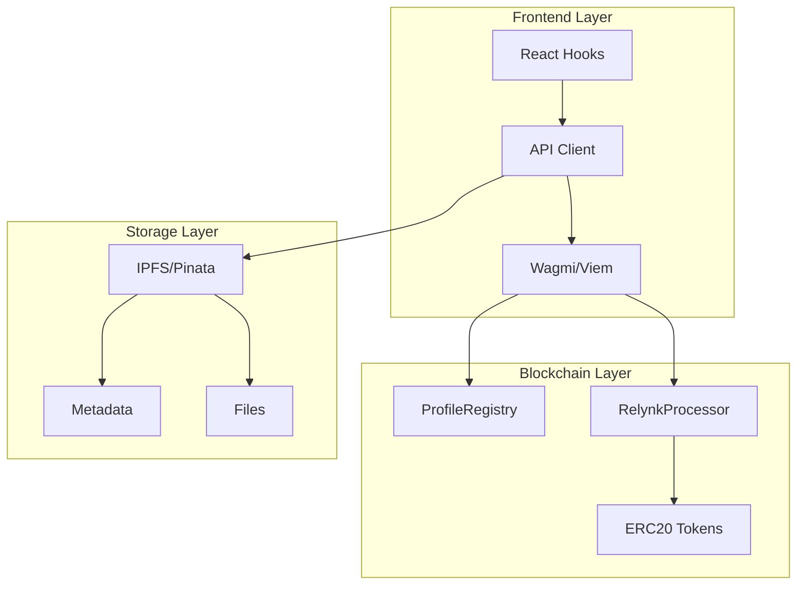

# API Reference

## 📋 Overview

This document provides comprehensive API documentation for Relynk's smart contracts, IPFS services, and frontend APIs. Whether you're integrating with Relynk or building on top of our platform, this guide will help you understand all available interfaces.

## 🏗️ Architecture Overview

Relynk's API consists of three main layers:

1. **Smart Contracts**: On-chain logic for payments and profiles
2. **IPFS Services**: Decentralized storage for metadata and files
3. **Frontend APIs**: Client-side utilities and hooks



---

## 🔗 Smart Contract APIs

### ProfileRegistry Contract

Manages user profiles and usernames on-chain.

#### Contract Addresses

| Network | Address |
|---------|----------|
| Lisk Sepolia | `0x742d35Cc6634C0532925a3b8D4C9db96c4b5Da5e` |
| Scroll Sepolia | `0x742d35Cc6634C0532925a3b8D4C9db96c4b5Da5e` |
| Morph Holesky | `0x742d35Cc6634C0532925a3b8D4C9db96c4b5Da5e` |
| Celo Sepolia | `0x742d35Cc6634C0532925a3b8D4C9db96c4b5Da5e` |
| Mantle Sepolia | `0x742d35Cc6634C0532925a3b8D4C9db96c4b5Da5e` |

#### Functions

##### `createProfile(string username, string metadataURI)`

Creates a new user profile.

**Parameters:**
- `username` (string): Unique username (3-20 characters, alphanumeric + hyphens)
- `metadataURI` (string): IPFS URI containing profile metadata

**Returns:**
- `profileId` (uint256): Unique profile identifier

**Events Emitted:**
- `ProfileCreated(address indexed user, uint256 indexed profileId, string username)`

**Example Usage:**
```typescript
import { useWriteContract } from 'wagmi';
import { ProfileRegistryABI } from '@/lib/contracts';

const { writeContract } = useWriteContract();

const createProfile = async (username: string, metadataURI: string) => {
  await writeContract({
    address: PROFILE_REGISTRY_ADDRESS,
    abi: ProfileRegistryABI,
    functionName: 'createProfile',
    args: [username, metadataURI]
  });
};
```

##### `updateProfile(string metadataURI)`

Updates existing profile metadata.

**Parameters:**
- `metadataURI` (string): New IPFS URI for profile metadata

**Events Emitted:**
- `ProfileUpdated(address indexed user, string metadataURI)`

##### `getProfile(address user)`

Retrieves profile information for a user.

**Parameters:**
- `user` (address): User's wallet address

**Returns:**
- `profileId` (uint256): Profile ID
- `username` (string): Username
- `metadataURI` (string): IPFS metadata URI
- `isActive` (bool): Profile status

**Example Usage:**
```typescript
import { useReadContract } from 'wagmi';

const { data: profile } = useReadContract({
  address: PROFILE_REGISTRY_ADDRESS,
  abi: ProfileRegistryABI,
  functionName: 'getProfile',
  args: [userAddress]
});
```

##### `isUsernameAvailable(string username)`

Checks if a username is available.

**Parameters:**
- `username` (string): Username to check

**Returns:**
- `available` (bool): True if username is available

#### Profile Metadata Schema

```json
{
  "name": "Creator Name",
  "bio": "Short description",
  "avatar": "ipfs://QmHash...",
  "website": "https://example.com",
  "social": {
    "twitter": "@username",
    "discord": "username#1234",
    "telegram": "@username"
  },
  "preferences": {
    "defaultCurrency": "USDC",
    "emailNotifications": true
  }
}
```

### RelynkProcessor Contract

Handles payment processing and link validation.

#### Contract Addresses

| Network | Address |
|---------|----------|
| Lisk Sepolia | `0x742d35Cc6634C0532925a3b8D4C9db96c4b5Da5e` |
| Scroll Sepolia | `0x742d35Cc6634C0532925a3b8D4C9db96c4b5Da5e` |
| Morph Holesky | `0x742d35Cc6634C0532925a3b8D4C9db96c4b5Da5e` |
| Celo Sepolia | `0x742d35Cc6634C0532925a3b8D4C9db96c4b5Da5e` |
| Mantle Sepolia | `0x742d35Cc6634C0532925a3b8D4C9db96c4b5Da5e` |

#### Functions

##### `processPayment(bytes32 linkId, uint256 amount, address token, bytes signature)`

Processes a payment for a payment link.

**Parameters:**
- `linkId` (bytes32): Unique identifier for the payment link
- `amount` (uint256): Payment amount in token's smallest unit
- `token` (address): ERC20 token contract address
- `signature` (bytes): Creator's signature validating the payment link

**Returns:**
- `paymentId` (uint256): Unique payment identifier

**Events Emitted:**
- `PaymentProcessed(bytes32 indexed linkId, address indexed buyer, address indexed creator, uint256 amount, address token, uint256 paymentId)`

**Example Usage:**
```typescript
import { parseUnits } from 'viem';
import { useWriteContract } from 'wagmi';

const { writeContract } = useWriteContract();

const processPayment = async ({
  linkId,
  amount,
  token,
  signature
}: {
  linkId: string;
  amount: string;
  token: SupportedToken;
  signature: string;
}) => {
  const amountWei = parseUnits(amount, token.decimals);
  
  await writeContract({
    address: RELYNK_PROCESSOR_ADDRESS,
    abi: RelynkProcessorABI,
    functionName: 'processPayment',
    args: [linkId, amountWei, token.address, signature]
  });
};
```

##### `getPayment(uint256 paymentId)`

Retrieves payment details.

**Parameters:**
- `paymentId` (uint256): Payment identifier

**Returns:**
- `linkId` (bytes32): Associated payment link ID
- `buyer` (address): Buyer's address
- `creator` (address): Creator's address
- `amount` (uint256): Payment amount
- `token` (address): Token used for payment
- `timestamp` (uint256): Payment timestamp
- `status` (uint8): Payment status

##### `validateSignature(bytes32 linkId, address creator, bytes signature)`

Validates a payment link signature.

**Parameters:**
- `linkId` (bytes32): Payment link ID
- `creator` (address): Creator's address
- `signature` (bytes): Signature to validate

**Returns:**
- `valid` (bool): True if signature is valid

#### Payment Link Signature

Payment links are secured using ECDSA signatures. The signature is created by hashing the link data and signing with the creator's private key.

**Signature Data Structure:**
```typescript
interface LinkSignatureData {
  linkId: string;
  creator: string;
  amount: bigint;
  token: string;
  expiry: bigint;
  nonce: bigint;
}
```

**Creating Signature:**
```typescript
import { hashMessage, signMessage } from 'viem';

const createLinkSignature = async (linkData: LinkSignatureData, privateKey: string) => {
  const message = `${linkData.linkId}:${linkData.creator}:${linkData.amount}:${linkData.token}:${linkData.expiry}:${linkData.nonce}`;
  const messageHash = hashMessage(message);
  const signature = await signMessage({ message: messageHash, privateKey });
  return signature;
};
```

---

## 📁 IPFS Services API

### UnifiedIPFSService

Handles all IPFS operations including metadata and file storage.

#### Configuration

```typescript
interface IPFSConfig {
  pinataJWT: string;
  gatewayUrl: string;
  timeout: number;
}

const ipfsService = new UnifiedIPFSService({
  pinataJWT: process.env.NEXT_PUBLIC_PINATA_JWT!,
  gatewayUrl: 'https://gateway.pinata.cloud',
  timeout: 30000
});
```

#### Methods

##### `uploadMetadata(metadata: object): Promise<string>`

Uploads JSON metadata to IPFS.

**Parameters:**
- `metadata` (object): JSON object to upload

**Returns:**
- `ipfsHash` (string): IPFS hash of uploaded metadata

**Example:**
```typescript
const linkMetadata = {
  title: "My Digital Product",
  description: "High-quality design templates",
  price: "10",
  currency: "USDC",
  type: "product",
  files: ["QmFileHash1", "QmFileHash2"]
};

const metadataHash = await ipfsService.uploadMetadata(linkMetadata);
```

##### `uploadFile(file: File): Promise<UploadResult>`

Uploads a file to IPFS with progress tracking.

**Parameters:**
- `file` (File): File object to upload

**Returns:**
```typescript
interface UploadResult {
  hash: string;
  size: number;
  url: string;
}
```

**Example:**
```typescript
const handleFileUpload = async (file: File) => {
  try {
    const result = await ipfsService.uploadFile(file);
    console.log('File uploaded:', result.hash);
    return result;
  } catch (error) {
    console.error('Upload failed:', error);
  }
};
```

##### `uploadMultipleFiles(files: File[]): Promise<UploadResult[]>`

Uploads multiple files concurrently.

**Parameters:**
- `files` (File[]): Array of files to upload

**Returns:**
- `results` (UploadResult[]): Array of upload results

##### `getMetadata(hash: string): Promise<object>`

Retrieves metadata from IPFS.

**Parameters:**
- `hash` (string): IPFS hash

**Returns:**
- `metadata` (object): Retrieved JSON metadata

##### `getFileUrl(hash: string): string`

Generates a gateway URL for an IPFS file.

**Parameters:**
- `hash` (string): IPFS hash

**Returns:**
- `url` (string): Gateway URL for the file

#### Metadata Schemas

##### Payment Link Metadata

```typescript
interface PaymentLinkMetadata {
  title: string;
  description: string;
  price: string;
  currency: string;
  type: 'payment' | 'donation' | 'product' | 'content';
  creator: string;
  createdAt: string;
  expiresAt?: string;
  maxUses?: number;
  currentUses: number;
  files?: string[]; // IPFS hashes
  preview?: string; // IPFS hash
  requirements?: string;
  deliveryInstructions?: string;
  tags?: string[];
  category?: string;
}
```

##### Product Metadata

```typescript
interface ProductMetadata {
  name: string;
  description: string;
  price: string;
  currency: string;
  files: {
    hash: string;
    name: string;
    size: number;
    type: string;
  }[];
  preview: {
    hash: string;
    type: 'image' | 'video';
  };
  category: string;
  tags: string[];
  license: string;
  version?: string;
  changelog?: string;
}
```

---

## 🎣 Frontend Hooks API

### Payment Links Hooks

#### `usePaymentLinks()`

Manages payment links for the current user.

**Returns:**
```typescript
interface UsePaymentLinksReturn {
  links: PaymentLink[];
  isLoading: boolean;
  error: Error | null;
  createLink: (data: CreateLinkFormData) => Promise<PaymentLink>;
  updateLink: (id: string, data: Partial<PaymentLink>) => Promise<PaymentLink>;
  deleteLink: (id: string) => Promise<void>;
  refetch: () => Promise<void>;
}
```

**Example:**
```typescript
function CreatorDashboard() {
  const { links, isLoading, createLink, deleteLink } = usePaymentLinks();
  
  const handleCreateLink = async (formData: CreateLinkFormData) => {
    try {
      const newLink = await createLink(formData);
      toast.success('Payment link created!');
    } catch (error) {
      toast.error('Failed to create link');
    }
  };
  
  if (isLoading) return <LoadingSpinner />;
  
  return (
    <div>
      {links.map(link => (
        <LinkCard 
          key={link.id} 
          link={link} 
          onDelete={() => deleteLink(link.id)}
        />
      ))}
    </div>
  );
}
```

#### `usePaymentLink(id: string)`

Fetches a specific payment link by ID.

**Parameters:**
- `id` (string): Payment link ID

**Returns:**
```typescript
interface UsePaymentLinkReturn {
  link: PaymentLink | null;
  isLoading: boolean;
  error: Error | null;
  refetch: () => Promise<void>;
}
```

#### `useCreatePaymentLink()`

Hook for creating new payment links.

**Returns:**
```typescript
interface UseCreatePaymentLinkReturn {
  createLink: (data: CreateLinkFormData) => Promise<PaymentLink>;
  isCreating: boolean;
  error: Error | null;
}
```

### Authentication Hooks

#### `useSIWEAuth()`

Manages Sign-In with Ethereum authentication.

**Returns:**
```typescript
interface UseSIWEAuthReturn {
  isAuthenticated: boolean;
  isLoading: boolean;
  user: User | null;
  signIn: () => Promise<void>;
  signOut: () => Promise<void>;
  error: Error | null;
}
```

**Example:**
```typescript
function AuthButton() {
  const { isAuthenticated, isLoading, signIn, signOut } = useSIWEAuth();
  
  if (isLoading) return <Spinner />;
  
  return (
    <Button onClick={isAuthenticated ? signOut : signIn}>
      {isAuthenticated ? 'Sign Out' : 'Sign In with Ethereum'}
    </Button>
  );
}
```

### Payment Processing Hooks

#### `useProcessPayment()`

Handles payment processing for buyers.

**Returns:**
```typescript
interface UseProcessPaymentReturn {
  processPayment: (params: ProcessPaymentParams) => Promise<PaymentResult>;
  isProcessing: boolean;
  error: Error | null;
}

interface ProcessPaymentParams {
  linkId: string;
  amount: string;
  token: SupportedToken;
  buyerEmail?: string;
}

interface PaymentResult {
  transactionHash: string;
  paymentId: string;
  accessToken?: string;
  downloadUrls?: string[];
}
```

**Example:**
```typescript
function PaymentButton({ link }: { link: PaymentLink }) {
  const { processPayment, isProcessing } = useProcessPayment();
  const { address } = useAccount();
  
  const handlePayment = async () => {
    if (!address) return;
    
    try {
      const result = await processPayment({
        linkId: link.id,
        amount: link.price,
        token: SUPPORTED_TOKENS.USDC
      });
      
      toast.success('Payment successful!');
      // Handle success (download files, access content, etc.)
    } catch (error) {
      toast.error('Payment failed');
    }
  };
  
  return (
    <Button 
      onClick={handlePayment} 
      disabled={isProcessing || !address}
    >
      {isProcessing ? 'Processing...' : `Pay ${link.price} ${link.currency}`}
    </Button>
  );
}
```

### IPFS Hooks

#### `useIPFSUpload()`

Handles file uploads to IPFS with progress tracking.

**Returns:**
```typescript
interface UseIPFSUploadReturn {
  upload: (files: File[]) => Promise<UploadResult[]>;
  uploadSingle: (file: File) => Promise<UploadResult>;
  isUploading: boolean;
  progress: MediaUploadProgress[];
  error: Error | null;
}

interface MediaUploadProgress {
  file: File;
  progress: number;
  status: 'pending' | 'uploading' | 'completed' | 'error';
  hash?: string;
  error?: string;
}
```

**Example:**
```typescript
function FileUploader() {
  const { upload, isUploading, progress } = useIPFSUpload();
  
  const handleFileSelect = async (files: File[]) => {
    try {
      const results = await upload(files);
      console.log('Upload completed:', results);
    } catch (error) {
      console.error('Upload failed:', error);
    }
  };
  
  return (
    <div>
      <FileDropzone onFilesSelected={handleFileSelect} />
      {isUploading && (
        <div>
          {progress.map((item, index) => (
            <ProgressBar 
              key={index}
              file={item.file}
              progress={item.progress}
              status={item.status}
            />
          ))}
        </div>
      )}
    </div>
  );
}
```

### Analytics Hooks

#### `useAnalytics()`

Provides analytics data for creators.

**Returns:**
```typescript
interface UseAnalyticsReturn {
  data: AnalyticsData | null;
  isLoading: boolean;
  error: Error | null;
  refetch: () => Promise<void>;
}

interface AnalyticsData {
  totalRevenue: string;
  totalSales: number;
  activeLinks: number;
  topPerformingLinks: PaymentLink[];
  revenueByDay: { date: string; revenue: string }[];
  salesByToken: { token: string; amount: string; count: number }[];
}
```

---

## 🌐 Network Configuration

### Supported Networks

```typescript
interface NetworkConfig {
  id: number;
  name: string;
  rpcUrl: string;
  blockExplorer: string;
  nativeCurrency: {
    name: string;
    symbol: string;
    decimals: number;
  };
  contracts: {
    profileRegistry: string;
    relynkProcessor: string;
  };
  tokens: SupportedToken[];
}

const SUPPORTED_NETWORKS: Record<number, NetworkConfig> = {
  4202: { // Lisk Sepolia
    id: 4202,
    name: 'Lisk Sepolia',
    rpcUrl: 'https://rpc.sepolia-api.lisk.com',
    blockExplorer: 'https://sepolia-blockscout.lisk.com',
    nativeCurrency: {
      name: 'Sepolia Ether',
      symbol: 'ETH',
      decimals: 18
    },
    contracts: {
      profileRegistry: '0x742d35Cc6634C0532925a3b8D4C9db96c4b5Da5e',
      relynkProcessor: '0x742d35Cc6634C0532925a3b8D4C9db96c4b5Da5e'
    },
    tokens: [
      {
        address: '0x1c7D4B196Cb0C7B01d743Fbc6116a902379C7238',
        symbol: 'USDC',
        name: 'USD Coin',
        decimals: 6
      }
    ]
  }
  // ... other networks
};
```

### Token Configuration

```typescript
interface SupportedToken {
  address: string;
  symbol: string;
  name: string;
  decimals: number;
  icon?: string;
  coingeckoId?: string;
}

const SUPPORTED_TOKENS = {
  USDC: {
    symbol: 'USDC',
    name: 'USD Coin',
    decimals: 6,
    icon: '/tokens/usdc.svg'
  },
  USDT: {
    symbol: 'USDT',
    name: 'Tether USD',
    decimals: 6,
    icon: '/tokens/usdt.svg'
  },
  IDRX: {
    symbol: 'IDRX',
    name: 'Indonesian Rupiah',
    decimals: 6,
    icon: '/tokens/idrx.svg'
  }
} as const;
```

---

## 🔧 Utility Functions

### Contract Helpers

```typescript
// Get contract configuration for current network
export function getContractConfig(chainId: number) {
  const network = SUPPORTED_NETWORKS[chainId];
  if (!network) throw new Error(`Unsupported network: ${chainId}`);
  return network.contracts;
}

// Get supported tokens for current network
export function getSupportedTokens(chainId: number): SupportedToken[] {
  const network = SUPPORTED_NETWORKS[chainId];
  if (!network) return [];
  return network.tokens;
}

// Get block explorer URL for transaction
export function getTransactionUrl(chainId: number, hash: string): string {
  const network = SUPPORTED_NETWORKS[chainId];
  if (!network) return '';
  return `${network.blockExplorer}/tx/${hash}`;
}
```

### Formatting Utilities

```typescript
import { formatUnits, parseUnits } from 'viem';

// Format token amount for display
export function formatTokenAmount(
  amount: bigint | string,
  decimals: number,
  symbol: string
): string {
  const formatted = formatUnits(BigInt(amount), decimals);
  return `${parseFloat(formatted).toFixed(2)} ${symbol}`;
}

// Parse user input to token amount
export function parseTokenAmount(
  amount: string,
  decimals: number
): bigint {
  return parseUnits(amount, decimals);
}

// Format IPFS URL
export function formatIPFSUrl(hash: string, gateway?: string): string {
  const gatewayUrl = gateway || 'https://gateway.pinata.cloud';
  return `${gatewayUrl}/ipfs/${hash}`;
}
```

### Validation Utilities

```typescript
// Validate username format
export function validateUsername(username: string): boolean {
  const regex = /^[a-zA-Z0-9-]{3,20}$/;
  return regex.test(username);
}

// Validate payment amount
export function validateAmount(amount: string): boolean {
  const num = parseFloat(amount);
  return !isNaN(num) && num > 0 && num <= 1000000;
}

// Validate Ethereum address
export function isValidAddress(address: string): boolean {
  return /^0x[a-fA-F0-9]{40}$/.test(address);
}
```

---

## 🚨 Error Handling

### Error Types

```typescript
interface RelynkError {
  code: string;
  message: string;
  details?: any;
}

const ERROR_CODES = {
  // Authentication errors
  AUTH_REQUIRED: 'AUTH_REQUIRED',
  INVALID_SIGNATURE: 'INVALID_SIGNATURE',
  
  // Payment errors
  INSUFFICIENT_BALANCE: 'INSUFFICIENT_BALANCE',
  PAYMENT_FAILED: 'PAYMENT_FAILED',
  INVALID_AMOUNT: 'INVALID_AMOUNT',
  
  // IPFS errors
  UPLOAD_FAILED: 'UPLOAD_FAILED',
  FILE_TOO_LARGE: 'FILE_TOO_LARGE',
  INVALID_FILE_TYPE: 'INVALID_FILE_TYPE',
  
  // Network errors
  NETWORK_ERROR: 'NETWORK_ERROR',
  UNSUPPORTED_NETWORK: 'UNSUPPORTED_NETWORK',
  
  // Validation errors
  INVALID_INPUT: 'INVALID_INPUT',
  USERNAME_TAKEN: 'USERNAME_TAKEN'
} as const;
```

### Error Handling Patterns

```typescript
// Hook error handling
const { data, error, isLoading } = usePaymentLinks();

if (error) {
  switch (error.code) {
    case ERROR_CODES.AUTH_REQUIRED:
      return <ConnectWalletPrompt />;
    case ERROR_CODES.NETWORK_ERROR:
      return <NetworkErrorMessage />;
    default:
      return <GenericErrorMessage error={error} />;
  }
}

// Async function error handling
const handleCreateLink = async (data: CreateLinkFormData) => {
  try {
    const link = await createLink(data);
    toast.success('Link created successfully!');
    return link;
  } catch (error) {
    if (error.code === ERROR_CODES.UPLOAD_FAILED) {
      toast.error('Failed to upload files. Please try again.');
    } else if (error.code === ERROR_CODES.INSUFFICIENT_BALANCE) {
      toast.error('Insufficient balance for transaction fees.');
    } else {
      toast.error('Failed to create link. Please try again.');
    }
    throw error;
  }
};
```

---

## 📊 Rate Limits & Quotas

### IPFS Upload Limits

- **File Size**: 100MB per file
- **Total Upload**: 1GB per day per user
- **Concurrent Uploads**: 5 files simultaneously
- **Supported Formats**: Images, PDFs, ZIP, videos, documents

### API Rate Limits

- **Metadata Queries**: 100 requests per minute
- **File Uploads**: 20 uploads per minute
- **Payment Processing**: No limit (blockchain-based)

### Smart Contract Limits

- **Username Length**: 3-20 characters
- **Payment Amount**: 0.01 to 1,000,000 tokens
- **Link Expiry**: Maximum 1 year
- **Max Uses**: Up to 10,000 per link

---

## 🔐 Security Considerations

### Best Practices

1. **Signature Validation**: Always validate payment link signatures
2. **Amount Verification**: Verify payment amounts match link requirements
3. **Expiry Checks**: Ensure links haven't expired
4. **Rate Limiting**: Implement client-side rate limiting
5. **Input Sanitization**: Sanitize all user inputs
6. **HTTPS Only**: Use HTTPS for all API calls

### Security Headers

```typescript
// Recommended security headers for API responses
const securityHeaders = {
  'Content-Security-Policy': "default-src 'self'",
  'X-Frame-Options': 'DENY',
  'X-Content-Type-Options': 'nosniff',
  'Referrer-Policy': 'strict-origin-when-cross-origin',
  'Permissions-Policy': 'camera=(), microphone=(), geolocation=()'
};
```

---

## 📚 Code Examples

### Complete Payment Flow

```typescript
import { useState } from 'react';
import { useAccount, useWriteContract } from 'wagmi';
import { parseUnits } from 'viem';

function PaymentFlow({ linkId }: { linkId: string }) {
  const [isProcessing, setIsProcessing] = useState(false);
  const { address } = useAccount();
  const { writeContract } = useWriteContract();
  
  // 1. Fetch payment link data
  const { data: linkData, isLoading } = usePaymentLink(linkId);
  
  // 2. Process payment
  const handlePayment = async () => {
    if (!linkData || !address) return;
    
    setIsProcessing(true);
    
    try {
      // Step 1: Approve token spending
      await writeContract({
        address: linkData.token.address,
        abi: ERC20_ABI,
        functionName: 'approve',
        args: [RELYNK_PROCESSOR_ADDRESS, parseUnits(linkData.price, linkData.token.decimals)]
      });
      
      // Step 2: Process payment
      await writeContract({
        address: RELYNK_PROCESSOR_ADDRESS,
        abi: RelynkProcessorABI,
        functionName: 'processPayment',
        args: [
          linkData.id,
          parseUnits(linkData.price, linkData.token.decimals),
          linkData.token.address,
          linkData.signature
        ]
      });
      
      // Step 3: Handle success
      toast.success('Payment successful!');
      
      // Step 4: Access content/files
      if (linkData.type === 'product') {
        const files = await fetchProductFiles(linkData.id);
        downloadFiles(files);
      }
      
    } catch (error) {
      console.error('Payment failed:', error);
      toast.error('Payment failed. Please try again.');
    } finally {
      setIsProcessing(false);
    }
  };
  
  if (isLoading) return <LoadingSpinner />;
  if (!linkData) return <NotFound />;
  
  return (
    <div className="payment-flow">
      <ProductPreview product={linkData} />
      <PaymentButton 
        onClick={handlePayment}
        disabled={isProcessing || !address}
        loading={isProcessing}
      >
        Pay {linkData.price} {linkData.token.symbol}
      </PaymentButton>
    </div>
  );
}
```

### Creating a Payment Link

```typescript
import { useForm } from 'react-hook-form';
import { zodResolver } from '@hookform/resolvers/zod';
import { z } from 'zod';

const createLinkSchema = z.object({
  title: z.string().min(1).max(100),
  description: z.string().min(1).max(500),
  price: z.string().regex(/^\d+(\.\d{1,6})?$/),
  currency: z.enum(['USDC', 'USDT', 'IDRX']),
  type: z.enum(['payment', 'product', 'donation']),
  files: z.array(z.instanceof(File)).optional()
});

type CreateLinkFormData = z.infer<typeof createLinkSchema>;

function CreateLinkForm() {
  const { createLink, isCreating } = useCreatePaymentLink();
  const { upload, isUploading } = useIPFSUpload();
  
  const form = useForm<CreateLinkFormData>({
    resolver: zodResolver(createLinkSchema)
  });
  
  const onSubmit = async (data: CreateLinkFormData) => {
    try {
      // 1. Upload files to IPFS
      let fileHashes: string[] = [];
      if (data.files && data.files.length > 0) {
        const uploadResults = await upload(data.files);
        fileHashes = uploadResults.map(result => result.hash);
      }
      
      // 2. Create payment link
      const link = await createLink({
        ...data,
        files: fileHashes
      });
      
      toast.success('Payment link created!');
      router.push(`/dashboard/links/${link.id}`);
      
    } catch (error) {
      toast.error('Failed to create payment link');
    }
  };
  
  return (
    <form onSubmit={form.handleSubmit(onSubmit)}>
      <Input
        {...form.register('title')}
        placeholder="Payment link title"
      />
      
      <Textarea
        {...form.register('description')}
        placeholder="Describe what buyers will get"
      />
      
      <div className="flex gap-4">
        <Input
          {...form.register('price')}
          placeholder="0.00"
          type="number"
          step="0.01"
        />
        
        <Select {...form.register('currency')}>
          <option value="USDC">USDC</option>
          <option value="USDT">USDT</option>
          <option value="IDRX">IDRX</option>
        </Select>
      </div>
      
      <FileUploader
        onFilesSelected={(files) => form.setValue('files', files)}
        maxFiles={10}
        maxSize={100 * 1024 * 1024} // 100MB
      />
      
      <Button 
        type="submit" 
        disabled={isCreating || isUploading}
      >
        {isCreating ? 'Creating...' : 'Create Payment Link'}
      </Button>
    </form>
  );
}
```

---

*This API reference provides comprehensive documentation for integrating with Relynk. For additional support, join our [Discord community](https://discord.gg/relynk) or check our [GitHub repository](https://github.com/relynk/relynk-frontend).*