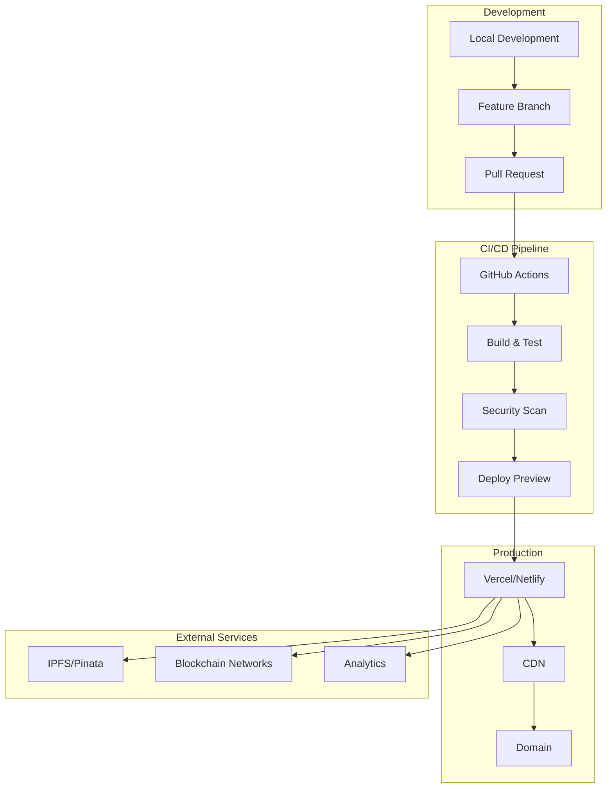

# Deployment Guide

## 📋 Overview

This guide covers deploying the Relynk frontend application to production environments. Relynk is built with Next.js 15 and can be deployed to various platforms including Vercel, Netlify, AWS, and self-hosted environments.

## 🏗️ Deployment Architecture



---

## 🔧 Environment Setup

### Required Environment Variables

Create environment files for different deployment stages:

#### `.env.local` (Development)
```bash
# App Configuration
NEXT_PUBLIC_APP_URL=http://localhost:3000
NEXT_PUBLIC_APP_NAME="Relynk"
NEXT_PUBLIC_APP_DESCRIPTION="Web3 Monetization Platform"

# Blockchain Configuration
NEXT_PUBLIC_DEFAULT_CHAIN_ID=4202
NEXT_PUBLIC_WALLETCONNECT_PROJECT_ID=your_walletconnect_project_id

# IPFS Configuration
NEXT_PUBLIC_PINATA_JWT=your_pinata_jwt_token
NEXT_PUBLIC_PINATA_GATEWAY=https://gateway.pinata.cloud

# Authentication
NEXTAUTH_SECRET=your_nextauth_secret_key
NEXTAUTH_URL=http://localhost:3000

# Analytics (Optional)
NEXT_PUBLIC_GOOGLE_ANALYTICS_ID=GA_MEASUREMENT_ID
NEXT_PUBLIC_MIXPANEL_TOKEN=your_mixpanel_token

# Feature Flags
NEXT_PUBLIC_ENABLE_ANALYTICS=true
NEXT_PUBLIC_ENABLE_NOTIFICATIONS=true
NEXT_PUBLIC_MAINTENANCE_MODE=false
```

#### `.env.production` (Production)
```bash
# App Configuration
NEXT_PUBLIC_APP_URL=https://relynk.app
NEXT_PUBLIC_APP_NAME="Relynk"
NEXT_PUBLIC_APP_DESCRIPTION="Web3 Monetization Platform"

# Blockchain Configuration
NEXT_PUBLIC_DEFAULT_CHAIN_ID=4202
NEXT_PUBLIC_WALLETCONNECT_PROJECT_ID=your_production_walletconnect_project_id

# IPFS Configuration
NEXT_PUBLIC_PINATA_JWT=your_production_pinata_jwt_token
NEXT_PUBLIC_PINATA_GATEWAY=https://gateway.pinata.cloud

# Authentication
NEXTAUTH_SECRET=your_production_nextauth_secret_key
NEXTAUTH_URL=https://relynk.app

# Analytics
NEXT_PUBLIC_GOOGLE_ANALYTICS_ID=your_production_ga_id
NEXT_PUBLIC_MIXPANEL_TOKEN=your_production_mixpanel_token

# Feature Flags
NEXT_PUBLIC_ENABLE_ANALYTICS=true
NEXT_PUBLIC_ENABLE_NOTIFICATIONS=true
NEXT_PUBLIC_MAINTENANCE_MODE=false

# Security
NEXT_PUBLIC_CSP_NONCE=random_nonce_for_csp
```

### Environment Variable Descriptions

| Variable | Description | Required | Example |
|----------|-------------|----------|----------|
| `NEXT_PUBLIC_APP_URL` | Application base URL | ✅ | `https://relynk.app` |
| `NEXT_PUBLIC_WALLETCONNECT_PROJECT_ID` | WalletConnect project ID | ✅ | `abc123...` |
| `NEXT_PUBLIC_PINATA_JWT` | Pinata API JWT token | ✅ | `eyJ0eXAi...` |
| `NEXTAUTH_SECRET` | NextAuth.js secret key | ✅ | `random_secret_key` |
| `NEXT_PUBLIC_GOOGLE_ANALYTICS_ID` | Google Analytics ID | ❌ | `G-XXXXXXXXXX` |
| `NEXT_PUBLIC_MAINTENANCE_MODE` | Enable maintenance mode | ❌ | `false` |

---

## 🚀 Deployment Platforms

### Vercel (Recommended)

Vercel provides the best experience for Next.js applications with automatic deployments and optimizations.

#### 1. Setup Vercel Project

```bash
# Install Vercel CLI
npm i -g vercel

# Login to Vercel
vercel login

# Deploy from project root
vercel
```

#### 2. Configure Vercel Project

Create `vercel.json` in project root:

```json
{
  "framework": "nextjs",
  "buildCommand": "npm run build",
  "devCommand": "npm run dev",
  "installCommand": "npm install",
  "outputDirectory": ".next",
  "regions": ["iad1", "sfo1", "lhr1"],
  "env": {
    "NEXT_PUBLIC_APP_URL": "https://relynk.app",
    "NEXT_PUBLIC_DEFAULT_CHAIN_ID": "4202"
  },
  "build": {
    "env": {
      "NEXT_TELEMETRY_DISABLED": "1"
    }
  },
  "functions": {
    "app/api/**/*.ts": {
      "maxDuration": 30
    }
  },
  "headers": [
    {
      "source": "/(.*)",
      "headers": [
        {
          "key": "X-Frame-Options",
          "value": "DENY"
        },
        {
          "key": "X-Content-Type-Options",
          "value": "nosniff"
        },
        {
          "key": "Referrer-Policy",
          "value": "strict-origin-when-cross-origin"
        }
      ]
    }
  ],
  "redirects": [
    {
      "source": "/github",
      "destination": "https://github.com/relynk/relynk-frontend",
      "permanent": false
    }
  ]
}
```

#### 3. Environment Variables in Vercel

1. Go to Vercel Dashboard → Project → Settings → Environment Variables
2. Add all required environment variables
3. Set different values for Preview and Production environments

#### 4. Custom Domain Setup

1. Go to Vercel Dashboard → Project → Settings → Domains
2. Add your custom domain (e.g., `relynk.app`)
3. Configure DNS records as instructed
4. Enable SSL (automatic with Vercel)

### Netlify

Alternative deployment platform with similar features.

#### 1. Setup Netlify Project

Create `netlify.toml` in project root:

```toml
[build]
  command = "npm run build"
  publish = ".next"

[build.environment]
  NEXT_TELEMETRY_DISABLED = "1"
  NODE_VERSION = "18"

[[headers]]
  for = "/*"
  [headers.values]
    X-Frame-Options = "DENY"
    X-Content-Type-Options = "nosniff"
    Referrer-Policy = "strict-origin-when-cross-origin"

[[redirects]]
  from = "/github"
  to = "https://github.com/relynk/relynk-frontend"
  status = 302

# Handle client-side routing
[[redirects]]
  from = "/*"
  to = "/index.html"
  status = 200
```

#### 2. Deploy to Netlify

```bash
# Install Netlify CLI
npm install -g netlify-cli

# Login to Netlify
netlify login

# Deploy
netlify deploy --prod
```

### AWS Amplify

For AWS-based deployments with additional AWS service integrations.

#### 1. Setup Amplify

```bash
# Install Amplify CLI
npm install -g @aws-amplify/cli

# Configure Amplify
amplify configure

# Initialize project
amplify init

# Add hosting
amplify add hosting

# Deploy
amplify publish
```

#### 2. Amplify Configuration

Create `amplify.yml`:

```yaml
version: 1
frontend:
  phases:
    preBuild:
      commands:
        - npm ci
    build:
      commands:
        - npm run build
  artifacts:
    baseDirectory: .next
    files:
      - '**/*'
  cache:
    paths:
      - node_modules/**/*
      - .next/cache/**/*
```

### Self-Hosted (Docker)

For custom infrastructure or on-premises deployments.

#### 1. Create Dockerfile

```dockerfile
# Build stage
FROM node:18-alpine AS builder

WORKDIR /app

# Copy package files
COPY package*.json ./
RUN npm ci --only=production

# Copy source code
COPY . .

# Build application
RUN npm run build

# Production stage
FROM node:18-alpine AS runner

WORKDIR /app

# Create non-root user
RUN addgroup --system --gid 1001 nodejs
RUN adduser --system --uid 1001 nextjs

# Copy built application
COPY --from=builder /app/public ./public
COPY --from=builder /app/.next/standalone ./
COPY --from=builder /app/.next/static ./.next/static

# Set ownership
USER nextjs

EXPOSE 3000

ENV PORT 3000
ENV HOSTNAME "0.0.0.0"

CMD ["node", "server.js"]
```

#### 2. Docker Compose

Create `docker-compose.yml`:

```yaml
version: '3.8'

services:
  relynk-frontend:
    build: .
    ports:
      - "3000:3000"
    environment:
      - NODE_ENV=production
      - NEXT_PUBLIC_APP_URL=https://your-domain.com
      - NEXT_PUBLIC_WALLETCONNECT_PROJECT_ID=${WALLETCONNECT_PROJECT_ID}
      - NEXT_PUBLIC_PINATA_JWT=${PINATA_JWT}
      - NEXTAUTH_SECRET=${NEXTAUTH_SECRET}
    restart: unless-stopped
    healthcheck:
      test: ["CMD", "curl", "-f", "http://localhost:3000/api/health"]
      interval: 30s
      timeout: 10s
      retries: 3

  nginx:
    image: nginx:alpine
    ports:
      - "80:80"
      - "443:443"
    volumes:
      - ./nginx.conf:/etc/nginx/nginx.conf
      - ./ssl:/etc/nginx/ssl
    depends_on:
      - relynk-frontend
    restart: unless-stopped
```

#### 3. Nginx Configuration

Create `nginx.conf`:

```nginx
events {
    worker_connections 1024;
}

http {
    upstream relynk {
        server relynk-frontend:3000;
    }

    server {
        listen 80;
        server_name your-domain.com;
        return 301 https://$server_name$request_uri;
    }

    server {
        listen 443 ssl http2;
        server_name your-domain.com;

        ssl_certificate /etc/nginx/ssl/cert.pem;
        ssl_certificate_key /etc/nginx/ssl/key.pem;

        location / {
            proxy_pass http://relynk;
            proxy_http_version 1.1;
            proxy_set_header Upgrade $http_upgrade;
            proxy_set_header Connection 'upgrade';
            proxy_set_header Host $host;
            proxy_set_header X-Real-IP $remote_addr;
            proxy_set_header X-Forwarded-For $proxy_add_x_forwarded_for;
            proxy_set_header X-Forwarded-Proto $scheme;
            proxy_cache_bypass $http_upgrade;
        }
    }
}
```

---

## 🔄 CI/CD Pipeline

### GitHub Actions

Create `.github/workflows/deploy.yml`:

```yaml
name: Deploy to Production

on:
  push:
    branches: [main]
  pull_request:
    branches: [main]

env:
  NODE_VERSION: '18'
  PNPM_VERSION: '8'

jobs:
  test:
    name: Test & Build
    runs-on: ubuntu-latest
    
    steps:
      - name: Checkout code
        uses: actions/checkout@v4
        
      - name: Setup Node.js
        uses: actions/setup-node@v4
        with:
          node-version: ${{ env.NODE_VERSION }}
          cache: 'npm'
          
      - name: Install dependencies
        run: npm ci
        
      - name: Run type checking
        run: npm run type-check
        
      - name: Run linting
        run: npm run lint
        
      - name: Run tests
        run: npm run test
        
      - name: Build application
        run: npm run build
        env:
          NEXT_PUBLIC_APP_URL: ${{ secrets.NEXT_PUBLIC_APP_URL }}
          NEXT_PUBLIC_WALLETCONNECT_PROJECT_ID: ${{ secrets.NEXT_PUBLIC_WALLETCONNECT_PROJECT_ID }}
          NEXT_PUBLIC_PINATA_JWT: ${{ secrets.NEXT_PUBLIC_PINATA_JWT }}
          
      - name: Upload build artifacts
        uses: actions/upload-artifact@v4
        with:
          name: build-files
          path: .next/
          
  security:
    name: Security Scan
    runs-on: ubuntu-latest
    needs: test
    
    steps:
      - name: Checkout code
        uses: actions/checkout@v4
        
      - name: Run security audit
        run: npm audit --audit-level=high
        
      - name: Scan for secrets
        uses: trufflesecurity/trufflehog@main
        with:
          path: ./
          base: main
          head: HEAD
          
  deploy-preview:
    name: Deploy Preview
    runs-on: ubuntu-latest
    needs: [test, security]
    if: github.event_name == 'pull_request'
    
    steps:
      - name: Checkout code
        uses: actions/checkout@v4
        
      - name: Deploy to Vercel Preview
        uses: amondnet/vercel-action@v25
        with:
          vercel-token: ${{ secrets.VERCEL_TOKEN }}
          vercel-org-id: ${{ secrets.VERCEL_ORG_ID }}
          vercel-project-id: ${{ secrets.VERCEL_PROJECT_ID }}
          scope: ${{ secrets.VERCEL_ORG_ID }}
          
  deploy-production:
    name: Deploy Production
    runs-on: ubuntu-latest
    needs: [test, security]
    if: github.ref == 'refs/heads/main'
    
    steps:
      - name: Checkout code
        uses: actions/checkout@v4
        
      - name: Deploy to Vercel Production
        uses: amondnet/vercel-action@v25
        with:
          vercel-token: ${{ secrets.VERCEL_TOKEN }}
          vercel-org-id: ${{ secrets.VERCEL_ORG_ID }}
          vercel-project-id: ${{ secrets.VERCEL_PROJECT_ID }}
          vercel-args: '--prod'
          scope: ${{ secrets.VERCEL_ORG_ID }}
          
      - name: Notify deployment
        uses: 8398a7/action-slack@v3
        with:
          status: ${{ job.status }}
          channel: '#deployments'
          webhook_url: ${{ secrets.SLACK_WEBHOOK }}
        if: always()
```

### Required GitHub Secrets

Add these secrets to your GitHub repository:

| Secret | Description |
|--------|-------------|
| `VERCEL_TOKEN` | Vercel API token |
| `VERCEL_ORG_ID` | Vercel organization ID |
| `VERCEL_PROJECT_ID` | Vercel project ID |
| `NEXT_PUBLIC_APP_URL` | Production app URL |
| `NEXT_PUBLIC_WALLETCONNECT_PROJECT_ID` | WalletConnect project ID |
| `NEXT_PUBLIC_PINATA_JWT` | Pinata JWT token |
| `SLACK_WEBHOOK` | Slack webhook for notifications |

---

## 🔍 Monitoring & Analytics

### Application Monitoring

#### 1. Health Check Endpoint

Create `app/api/health/route.ts`:

```typescript
import { NextResponse } from 'next/server';

export async function GET() {
  try {
    // Check critical services
    const checks = {
      timestamp: new Date().toISOString(),
      status: 'healthy',
      version: process.env.npm_package_version || '1.0.0',
      environment: process.env.NODE_ENV,
      services: {
        ipfs: await checkIPFSConnection(),
        blockchain: await checkBlockchainConnection(),
        database: true // Add actual DB check if needed
      }
    };
    
    return NextResponse.json(checks, { status: 200 });
  } catch (error) {
    return NextResponse.json(
      { status: 'unhealthy', error: error.message },
      { status: 503 }
    );
  }
}

async function checkIPFSConnection(): Promise<boolean> {
  try {
    const response = await fetch('https://gateway.pinata.cloud/ipfs/QmYwAPJzv5CZsnA625s3Xf2nemtYgPpHdWEz79ojWnPbdG');
    return response.ok;
  } catch {
    return false;
  }
}

async function checkBlockchainConnection(): Promise<boolean> {
  try {
    // Add actual blockchain connectivity check
    return true;
  } catch {
    return false;
  }
}
```

#### 2. Error Tracking with Sentry

Install and configure Sentry:

```bash
npm install @sentry/nextjs
```

Create `sentry.client.config.ts`:

```typescript
import * as Sentry from '@sentry/nextjs';

Sentry.init({
  dsn: process.env.NEXT_PUBLIC_SENTRY_DSN,
  environment: process.env.NODE_ENV,
  tracesSampleRate: 0.1,
  debug: false,
  integrations: [
    new Sentry.BrowserTracing({
      tracePropagationTargets: ['localhost', /^https:\/\/relynk\.app/],
    }),
  ],
});
```

#### 3. Performance Monitoring

Create `lib/analytics.ts`:

```typescript
import { getCLS, getFID, getFCP, getLCP, getTTFB } from 'web-vitals';

export function reportWebVitals(metric: any) {
  // Send to analytics service
  if (process.env.NEXT_PUBLIC_GOOGLE_ANALYTICS_ID) {
    gtag('event', metric.name, {
      event_category: 'Web Vitals',
      value: Math.round(metric.value),
      event_label: metric.id,
      non_interaction: true,
    });
  }
  
  // Send to custom analytics
  fetch('/api/analytics/web-vitals', {
    method: 'POST',
    headers: { 'Content-Type': 'application/json' },
    body: JSON.stringify(metric),
  });
}

// Initialize web vitals tracking
export function initWebVitals() {
  getCLS(reportWebVitals);
  getFID(reportWebVitals);
  getFCP(reportWebVitals);
  getLCP(reportWebVitals);
  getTTFB(reportWebVitals);
}
```

### Uptime Monitoring

Set up external monitoring with services like:

- **Pingdom**: Website uptime monitoring
- **UptimeRobot**: Free uptime monitoring
- **StatusPage**: Status page for users
- **DataDog**: Comprehensive monitoring

---

## 🔒 Security Configuration

### Content Security Policy

Create `next.config.ts` with CSP:

```typescript
const ContentSecurityPolicy = `
  default-src 'self';
  script-src 'self' 'unsafe-eval' 'unsafe-inline' *.vercel-analytics.com *.google-analytics.com;
  style-src 'self' 'unsafe-inline' fonts.googleapis.com;
  img-src 'self' data: blob: *.pinata.cloud *.ipfs.io;
  font-src 'self' fonts.gstatic.com;
  connect-src 'self' *.pinata.cloud *.infura.io *.alchemy.com *.walletconnect.org wss:;
  frame-src 'none';
  object-src 'none';
  base-uri 'self';
  form-action 'self';
  frame-ancestors 'none';
  upgrade-insecure-requests;
`;

const securityHeaders = [
  {
    key: 'Content-Security-Policy',
    value: ContentSecurityPolicy.replace(/\s{2,}/g, ' ').trim()
  },
  {
    key: 'Referrer-Policy',
    value: 'strict-origin-when-cross-origin'
  },
  {
    key: 'X-Frame-Options',
    value: 'DENY'
  },
  {
    key: 'X-Content-Type-Options',
    value: 'nosniff'
  },
  {
    key: 'X-DNS-Prefetch-Control',
    value: 'false'
  },
  {
    key: 'Strict-Transport-Security',
    value: 'max-age=31536000; includeSubDomains'
  },
  {
    key: 'Permissions-Policy',
    value: 'camera=(), microphone=(), geolocation=()'
  }
];

const nextConfig = {
  async headers() {
    return [
      {
        source: '/(.*)',
        headers: securityHeaders,
      },
    ];
  },
};

export default nextConfig;
```

### Environment Security

1. **Never commit secrets** to version control
2. **Use environment-specific** configurations
3. **Rotate API keys** regularly
4. **Implement rate limiting** for API endpoints
5. **Use HTTPS** for all communications
6. **Validate all inputs** on both client and server

---

## 🚨 Troubleshooting

### Common Deployment Issues

#### Build Failures

```bash
# Clear Next.js cache
rm -rf .next
npm run build

# Clear node_modules
rm -rf node_modules package-lock.json
npm install
npm run build

# Check for TypeScript errors
npm run type-check
```

#### Environment Variable Issues

```bash
# Verify environment variables are loaded
echo $NEXT_PUBLIC_WALLETCONNECT_PROJECT_ID

# Check for missing variables
npm run build 2>&1 | grep "NEXT_PUBLIC"
```

#### Memory Issues

```bash
# Increase Node.js memory limit
export NODE_OPTIONS="--max-old-space-size=4096"
npm run build
```

#### IPFS Connection Issues

```bash
# Test IPFS connectivity
curl -I https://gateway.pinata.cloud/ipfs/QmYwAPJzv5CZsnA625s3Xf2nemtYgPpHdWEz79ojWnPbdG

# Verify Pinata JWT token
curl -H "Authorization: Bearer $PINATA_JWT" https://api.pinata.cloud/data/testAuthentication
```

### Performance Optimization

#### Bundle Analysis

```bash
# Analyze bundle size
npm install -g @next/bundle-analyzer
ANALYZE=true npm run build
```

#### Image Optimization

```typescript
// next.config.ts
const nextConfig = {
  images: {
    domains: ['gateway.pinata.cloud', 'ipfs.io'],
    formats: ['image/webp', 'image/avif'],
    minimumCacheTTL: 60,
  },
};
```

#### Caching Strategy

```typescript
// app/layout.tsx
export const metadata = {
  other: {
    'Cache-Control': 'public, max-age=31536000, immutable',
  },
};
```

---

## 📊 Deployment Checklist

### Pre-Deployment

- [ ] All tests passing
- [ ] TypeScript compilation successful
- [ ] Linting issues resolved
- [ ] Security audit completed
- [ ] Environment variables configured
- [ ] Build optimization verified
- [ ] Performance metrics acceptable

### Post-Deployment

- [ ] Health check endpoint responding
- [ ] All pages loading correctly
- [ ] Wallet connection working
- [ ] IPFS uploads functional
- [ ] Payment processing operational
- [ ] Analytics tracking active
- [ ] Error monitoring configured
- [ ] SSL certificate valid
- [ ] CDN caching optimized

### Rollback Plan

1. **Immediate Rollback**: Revert to previous deployment
2. **Database Rollback**: Restore database if schema changes
3. **DNS Rollback**: Point domain to previous version
4. **Communication**: Notify team and users of issues

---

## 📈 Scaling Considerations

### Horizontal Scaling

- **CDN**: Use Cloudflare or AWS CloudFront
- **Load Balancing**: Distribute traffic across multiple instances
- **Edge Computing**: Deploy to edge locations for better performance

### Vertical Scaling

- **Server Resources**: Increase CPU and memory allocation
- **Database Optimization**: Optimize queries and indexing
- **Caching**: Implement Redis for session and data caching

### Cost Optimization

- **Bundle Size**: Minimize JavaScript bundle size
- **Image Optimization**: Use WebP and AVIF formats
- **Lazy Loading**: Implement component and route lazy loading
- **Tree Shaking**: Remove unused code from bundles

---

*This deployment guide ensures reliable and secure deployment of the Relynk frontend. For additional support, consult the [troubleshooting section](./for-developers.md#troubleshooting) or reach out to the development team.*