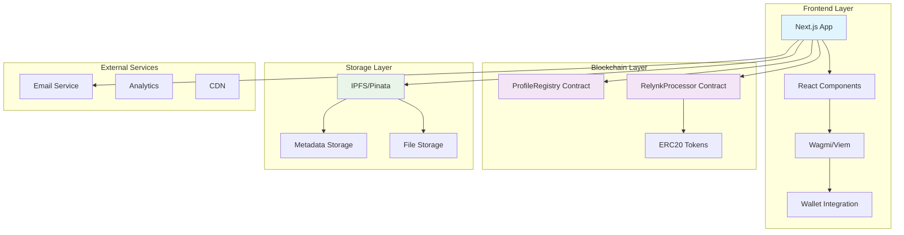
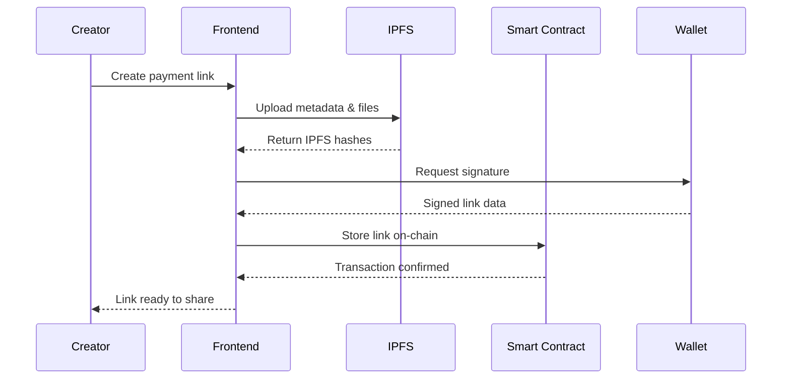
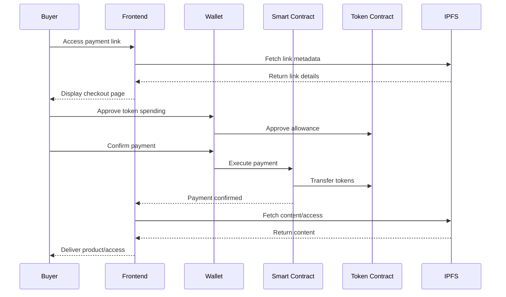

# Relynk Project Overview

## 🎯 Business Context

### The Problem We're Solving

In today's digital economy, creators face significant challenges when monetizing their content and services:

- **Platform Dependency**: Reliance on centralized platforms like Gumroad, Stripe, or PayPal that can freeze accounts or change terms
- **High Fees**: Traditional payment processors charge 3-5% plus transaction fees
- **Geographic Restrictions**: Many payment services aren't available globally
- **Slow Payouts**: Traditional platforms hold funds for days or weeks
- **Limited Customization**: Creators can't fully control their checkout experience
- **No True Ownership**: Creators don't own their customer relationships or payment data

### Our Solution

Relynk is a **Web3-native monetization platform** that gives creators complete control over their payment infrastructure while maintaining the simplicity of traditional payment links.

**Think of it as:** "Gumroad meets Web3" - all the ease of use you expect, powered by blockchain technology.

## 🌟 Value Proposition

### For Creators
- **True Ownership**: Your payment links, your data, your customers
- **Global Access**: Accept payments from anyone, anywhere, without restrictions
- **Instant Settlements**: Payments settle directly to your wallet in seconds
- **Lower Fees**: Minimal platform fees compared to traditional services
- **Censorship Resistant**: No risk of account freezing or platform changes
- **Multi-Chain Support**: Accept payments across multiple blockchain networks

### For Buyers
- **Secure Payments**: Blockchain-verified transactions
- **Privacy Focused**: No need to share sensitive financial information
- **Global Accessibility**: Pay with crypto from anywhere in the world
- **Transparent Pricing**: No hidden fees or currency conversion charges
- **Instant Access**: Immediate content delivery after payment

## 🏗️ System Architecture

### High-Level Architecture

### Component Architecture

#### 1. Frontend Application (Next.js)
- **Framework**: Next.js 15 with App Router for optimal performance
- **UI Components**: shadcn/ui built on Radix primitives
- **State Management**: TanStack Query for server state
- **Styling**: Tailwind CSS for rapid development
- **Authentication**: SIWE (Sign-In with Ethereum) integration

#### 2. Smart Contracts

**ProfileRegistry Contract**
- Manages user profiles and usernames
- Handles profile metadata and settings
- Stores creator information on-chain

**RelynkProcessor Contract**
- Processes all payment transactions
- Validates payment links and signatures
- Handles different payment types (fixed, dynamic, donations)
- Manages platform fees and creator payouts

#### 3. IPFS Storage
- **Metadata Storage**: Payment link details, product information
- **File Storage**: Digital products, images, documents
- **Decentralized**: No single point of failure
- **Immutable**: Content addressing ensures data integrity

#### 4. Multi-Chain Support
Currently supporting testnets with plans for mainnet deployment:
- Lisk Sepolia (Primary)
- Scroll Sepolia
- Morph Holesky
- Celo Sepolia
- Mantle Sepolia

## 🔄 Data Flow

### Payment Link Creation Flow

### Payment Processing Flow

## 🎯 Use Cases

### 1. Digital Product Sales
**Example**: A designer selling Figma templates
- Upload template files to IPFS
- Create payment link with fixed price
- Share link on social media
- Buyers pay with USDC and get instant download

### 2. Content Monetization
**Example**: A developer selling a coding course
- Create token-gated access link
- Set course price in stablecoins
- Buyers get NFT/SBT proof of purchase
- Access granted to exclusive content portal

### 3. Service Payments
**Example**: A freelancer accepting project payments
- Create invoice-style payment link
- Include project details and terms
- Client pays directly to freelancer's wallet
- Instant settlement, no intermediaries

### 4. Donations & Tips
**Example**: A content creator accepting tips
- Create donation link with dynamic pricing
- Supporters can choose any amount
- Include personal message with donation
- Real-time donation tracking

### 5. Event Ticketing
**Example**: Selling tickets to a Web3 conference
- Create limited-use payment links
- Each payment mints a ticket NFT
- Automatic access control at event
- Secondary market trading enabled

## 🔐 Security Model

### Smart Contract Security
- **Audited Contracts**: All contracts undergo security audits
- **Signature Verification**: ECDSA signatures prevent tampering
- **Access Controls**: Role-based permissions for admin functions
- **Reentrancy Protection**: Guards against common attack vectors

### Data Security
- **Decentralized Storage**: No single point of failure
- **Encryption**: Sensitive content encrypted before IPFS upload
- **Wallet Security**: Users maintain custody of their funds
- **Privacy**: Minimal personal data collection

### Platform Security
- **SIWE Authentication**: Secure wallet-based login
- **Rate Limiting**: Protection against spam and abuse
- **Input Validation**: Comprehensive data sanitization
- **HTTPS Everywhere**: End-to-end encryption

## 📊 Business Model

### Revenue Streams
1. **Platform Fees**: Small percentage on transactions (typically 1-2%)
2. **Premium Features**: Advanced analytics, custom branding
3. **Enterprise Solutions**: White-label deployments
4. **Network Fees**: Gas optimization services

### Competitive Advantages
- **First-Mover**: Early Web3 payment link platform
- **Multi-Chain**: Support for multiple blockchain networks
- **Developer-Friendly**: Open-source and extensible
- **Community-Driven**: Decentralized governance model

## 🚀 Roadmap

### Phase 1: MVP (Current)
- ✅ Basic payment link creation
- ✅ Multi-chain testnet support
- ✅ IPFS integration
- ✅ Wallet authentication
- ✅ Digital product delivery

### Phase 2: Enhanced Features
- 🔄 Mainnet deployment
- 🔄 Advanced analytics dashboard
- 🔄 Subscription payments
- 🔄 Mobile app
- 🔄 API for developers

### Phase 3: Ecosystem
- 📋 Plugin marketplace
- 📋 Third-party integrations
- 📋 DAO governance
- 📋 Cross-chain bridges
- 📋 Fiat on/off ramps

### Phase 4: Scale
- 📋 Enterprise solutions
- 📋 White-label platform
- 📋 Global expansion
- 📋 Institutional features
- 📋 Advanced DeFi integration

## 🎯 Target Market

### Primary Users
- **Digital Creators**: Artists, designers, writers, musicians
- **Freelancers**: Developers, consultants, service providers
- **Educators**: Course creators, coaches, tutors
- **Small Businesses**: E-commerce, digital agencies

### Market Size
- **Creator Economy**: $104B+ globally
- **Freelance Market**: $400B+ annually
- **Digital Products**: $10B+ market
- **Web3 Adoption**: Growing 100%+ year-over-year

## 🌍 Impact & Vision

### Our Vision
**"To democratize digital commerce by giving every creator the tools to monetize their work without intermediaries."**

### Long-term Impact
- **Financial Inclusion**: Enable creators in underbanked regions
- **Creator Empowerment**: True ownership of digital businesses
- **Innovation Catalyst**: Accelerate Web3 adoption
- **Economic Freedom**: Reduce dependence on traditional finance

### Success Metrics
- **Creators Onboarded**: Target 10K+ in first year
- **Transaction Volume**: $1M+ processed monthly
- **Geographic Reach**: Available in 50+ countries
- **Platform Adoption**: 100+ integrations

---

*This overview provides the foundation for understanding Relynk's mission, architecture, and potential impact in the evolving creator economy.*